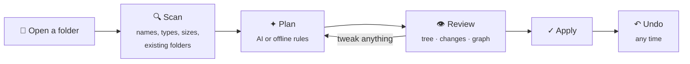

<p align="center">
  
</p>

<p align="center">
  
  
  
  
  <a href="LICENSE"></a>
</p>

<p align="center">
  <a href="#-get-it"><b>Get it</b></a> &nbsp;·&nbsp;
  <a href="#-how-it-works"><b>How it works</b></a> &nbsp;·&nbsp;
  <a href="#-features"><b>Features</b></a> &nbsp;·&nbsp;
  <a href="#-make-it-yours"><b>Make it yours</b></a> &nbsp;·&nbsp;
  <a href="#-shortcuts"><b>Shortcuts</b></a> &nbsp;·&nbsp;
  <a href="#-development"><b>Development</b></a> &nbsp;·&nbsp;
  <a href="#-license"><b>License</b></a>
</p>

<br>

Your Downloads folder is a mess, and every tool that promises to fix it either dumps everything into `Images/` and `Documents/` or moves things without asking. **Onyx is different.** It reads names and the folders you already have, and it plans a structure that makes sense. Nothing on disk moves until you've seen every change and said yes. And if you change your mind, one click puts everything back.

<p align="center">
  
</p>

<br>

## ⬇ Get it

> [!IMPORTANT]
> Onyx is proprietary software. The code is public so you can see it, but building, running, copying or redistributing it needs written permission. See [License](#-license).

> [!TIP]
> No installer, no Node.js, no admin rights. One double-click builds the app.

1. **Download** this repo: **Code → Download ZIP**, then unzip it anywhere.
2. **Double-click `Build Onyx.bat`.**
3. Onyx opens. It also lives at `Downloads\onyx\Onyx.exe`, with shortcuts on your desktop and in the Start menu.

<details>
<summary><b>What does the build script actually do?</b></summary>
<br>

| Step | |
| --- | --- |
| 1 | Downloads the official **Electron 32 runtime for Windows x64** from GitHub |
| 2 | Verifies it against Electron's published **SHA-256 checksums** (it stops if they don't match) |
| 3 | Adds the Onyx app files and renames `electron.exe` to `Onyx.exe` |
| 4 | Stamps the **onyx stone icon** and version info onto the exe with `rcedit` |
| 5 | Creates desktop and Start menu shortcuts and refreshes Windows' icon cache |

The download is cached in `%LOCALAPPDATA%\onyx-build`, so running it again to update takes a few seconds.
</details>

<br>

## ◆ How it works



| | |
| --- | --- |
| **Scan** | Onyx reads the folder: file names, types, sizes and dates, plus the folders already there. |
| **Plan** | It proposes where every file should go, reusing your folders wherever it can. |
| **Review** | You see the result three ways: a proposed folder tree, a checklist of every move, and a live graph. Right-click anything to move it, keep it, or turn it into a rule. |
| **Apply** | Only the moves you left checked happen. Name clashes become `file (2).pdf`; nothing is ever overwritten. |
| **Undo** | Every apply writes a journal. One click restores everything exactly as it was. |

<br>

## ✦ Features

<table>
<tr>
<td width="50%" valign="top">

### Understands what things *are*
It doesn't just sort by extension. `tax_return_2023.pdf` goes to **Finance/Taxes**, `IMG_4521.jpg` joins your existing **Photos** folder, and `excavatorio1/2/3.obj` gets grouped as a series. Your own rules, like *"anything with minecraft → Games/Minecraft"*, always win.

</td>
<td width="50%" valign="top">

### Knows what to leave alone
Folders that work as one piece **stay together**: a website (HTML plus its JS and CSS), a code project, a game with its DLLs, a 3D model with its textures, a music project. Folders you named yourself, like **School** or **Work**, are respected. General dumping grounds like **New folder** get sorted.

</td>
</tr>
<tr>
<td colspan="2">

</td>
</tr>
</table>

**Strategies**

| Strategy | What it does |
| --- | --- |
| ✦ **AI smart** | Reads names and your existing folders, and groups files by what they're *for* |
| ⚡ **Smart rules** | The same idea fully offline: keywords, series detection and file types |
| ▤ **By type** | Images, Documents, 3D Models, Installers, … |
| ◷ **By date** | Year and month each file was last changed |
| ◫ **By size** | Small, medium, large and huge |
| ⤒ **Flatten** | Pulls files out of subfolders to the top level (bundles stay intact) |

**Inside folders**: choose how deep Onyx goes.

| Mode | Behaviour |
| --- | --- |
| **Smart** *(default)* | Re-sorts general folders (`New folder`, `Documents`, `Other`, …), keeps your named folders and bundles |
| **Everything** | Re-sorts every subfolder; bundles still stay together |
| **Only loose files** | Never looks inside folders |

**AI providers**: optional. Onyx works fully offline with rules.

| Provider | Key needed | Default model |
| --- | --- | --- |
| free.ai | yes | `qwen3-8b` |
| Pollinations | no | `openai` |
| Any OpenAI-compatible API | yes | `gpt-4o-mini` |
| Anthropic | yes | `claude-haiku-5-5` |

Keys are encrypted with Windows' own credential protection. AI answers are sanitized: no `..` paths, no moving files into your projects, and a fallback to rules if the AI is down or talks nonsense.

<br>

## 🎨 Make it yours

Every panel is a tab you can **drag anywhere**: into either sidebar, into another tab bar, or onto the edge of a pane to split the window. Right-click a tab for the same options, or start from a preset: *Classic, Swapped, Review, Stacked, Focus*.

<p align="center">
  
</p>

<table>
<tr>
<td width="50%" valign="top">

### Build your own color scheme
Pick a background and an accent, and Onyx **generates the whole palette**. Then fine-tune any color. The entire app previews live, every text color shows its contrast ratio, and schemes can be shared as a code.

</td>
<td width="50%" valign="top">

### Or use one of 12 built-in themes
Eight dark (Onyx, Jet, Graphite, Lapis, Jade, Amber, Garnet, Amethyst) and four light (Pearl, Marble, Quartz, Sage), or follow Windows. Plus fonts, zoom, density, corner rounding and custom CSS.

</td>
</tr>
<tr>
<td></td>
<td></td>
</tr>
</table>

<details>
<summary><b>Everything else you can change</b></summary>
<br>


| Section | Highlights |
| --- | --- |
| **General** | Reopen last folder on startup, what to show after organizing, confirm before applying, notification duration |
| **Appearance** | Themes, your own color schemes, accent, fonts, zoom, density, roundness, reduced motion |
| **Layout** | Presets, where each panel lives, ribbon and status bar |
| **File explorer** | Sort order, folders first, type tags, sizes, marks on files that will move, indent guides |
| **Graph view** | Files and labels on or off, color by folder or type, node size, link distance, repel force, text fade |
| **Organizing** | How deep to sort, series threshold, max depth, rename built-in folders (`Images` → `Pictures`) |
| **My rules** | Keyword, extension, pattern, size and age rules; never-move list; folders to keep together or always sort inside |
| **AI provider** | Provider, model, key, and your own instructions |
| **Hotkeys** | Rebind any shortcut |
| **Advanced** | Custom CSS, export and import settings, resets |

Settings are searchable (`Ctrl + ,`, then type).
</details>

<br>

## ⌨ Shortcuts

| Action | Keys | | Action | Keys |
| --- | --- | --- | --- | --- |
| Command palette | <kbd>Ctrl</kbd> <kbd>P</kbd> | | Proposed structure | <kbd>Ctrl</kbd> <kbd>1</kbd> |
| Open folder | <kbd>Ctrl</kbd> <kbd>O</kbd> | | Changes | <kbd>Ctrl</kbd> <kbd>2</kbd> |
| Organize | <kbd>Ctrl</kbd> <kbd>Enter</kbd> | | Graph view | <kbd>Ctrl</kbd> <kbd>G</kbd> |
| Apply plan | <kbd>Ctrl</kbd> <kbd>Shift</kbd> <kbd>Enter</kbd> | | Files | <kbd>Ctrl</kbd> <kbd>Shift</kbd> <kbd>E</kbd> |
| Undo last organize | <kbd>Ctrl</kbd> <kbd>Z</kbd> | | Search files | <kbd>Ctrl</kbd> <kbd>Shift</kbd> <kbd>F</kbd> |
| Reload from disk | <kbd>Ctrl</kbd> <kbd>R</kbd> | | Toggle sidebars | <kbd>Ctrl</kbd> <kbd>[</kbd> / <kbd>]</kbd> |
| Settings | <kbd>Ctrl</kbd> <kbd>,</kbd> | | Light / dark | <kbd>Ctrl</kbd> <kbd>Shift</kbd> <kbd>L</kbd> |
| Zoom | <kbd>Ctrl</kbd> <kbd>=</kbd> / <kbd>-</kbd> / <kbd>0</kbd> | | | |

All of these can be changed in **Settings → Hotkeys**.

<br>

## 🛡 Safe by design

- **Nothing moves until you apply.** Planning is read-only.
- **Never overwrites.** Clashes get ` (2)`, ` (3)`, and so on.
- **Every apply can be undone**, even after restarting Onyx.
- **Refuses dangerous places**: drive roots, Windows and Program Files, your whole user folder.
- **Skips system files** like `desktop.ini`, `Thumbs.db` and `pagefile.sys`, and never opens `node_modules`, `.git` or virtual environments.
- **AI can't escape the folder.** Paths are sanitized and checked before anything is planned.

<br>

## ❓ FAQ

<details>
<summary><b>Do I need an AI key?</b></summary>
<br>
No. <b>Smart rules</b> works fully offline, and Pollinations needs no key. A key (free.ai, OpenAI-compatible or Anthropic) just makes AI smart sharper.
</details>

<details>
<summary><b>How do I add an API key without typing it?</b></summary>
<br>
Put a text file named <code>ai-key.txt</code> containing the key next to <code>Onyx.exe</code> (or in <code>resources\app</code>) and start Onyx. It imports the key encrypted, picks the right provider, and <b>deletes the file</b>. The file is in <code>.gitignore</code>, so it can't be committed by accident.
</details>

<details>
<summary><b>Can I try it without touching my files?</b></summary>
<br>
Yes. Click the flask icon in the ribbon to open the <b>demo vault</b>: a realistic messy folder that only exists in memory.
</details>

<details>
<summary><b>The taskbar still shows an old icon</b></summary>
<br>
Windows caches icons aggressively. Run <code>Build Onyx.bat</code> again (it refreshes the cache), or sign out and back in.
</details>

<br>

## 🛠 Development

Needs [Node.js](https://nodejs.org).

```bash
npm install
npm start        # run with Electron
npm test         # organizing, undo, settings and AI-provider tests (no Electron needed)
npm run dist     # package with electron-builder (Windows x64)
```

```
onyx/
├── main.js          Electron main process: scan, apply, undo, AI providers, settings
├── preload.js       the window.onyx bridge (context-isolated)
├── engine.js        pure organizing logic, shared by main and renderer
├── renderer.js      app UI and commands
├── workspace.js     draggable, dockable panels
├── settings.js      settings window and color scheme builder
├── theme.js         theme engine, presets and palette generator
├── graph.js         force-directed graph view
├── icons.js         Lucide icons
├── build-onyx.ps1   no-tools Windows build (run via "Build Onyx.bat")
└── test/            Node tests
```

<br>

## ⚖ License

**Copyright © 2026 Alexander Dunn. All rights reserved.**

Onyx is proprietary. You're welcome to read the code here on GitHub, but no license is granted: copying, modifying, building, running, redistributing or selling it, in whole or in part, needs prior written permission. Forking on GitHub doesn't grant any of those rights. The full terms are in [`LICENSE`](LICENSE). For permission or licensing enquiries, get in touch via [@Barbaqueda](https://github.com/Barbaqueda).

<br>

<p align="center">
  <br>
  <sub>Onyx: tidy folders, no surprises.</sub>
</p>
