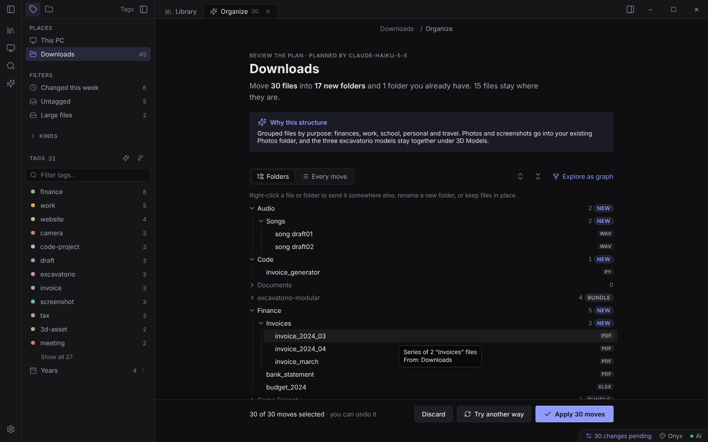
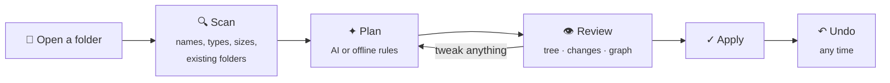
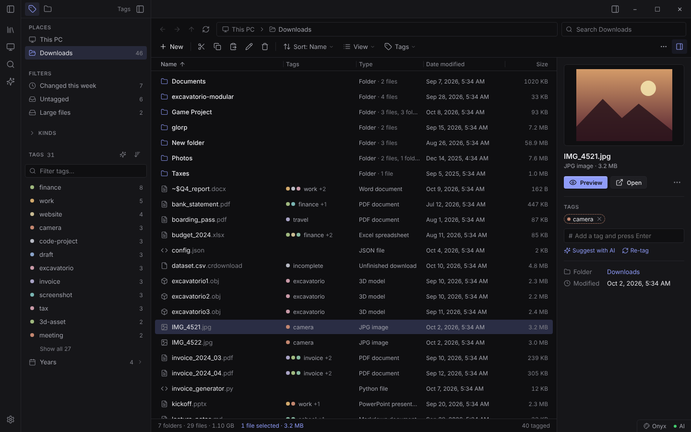
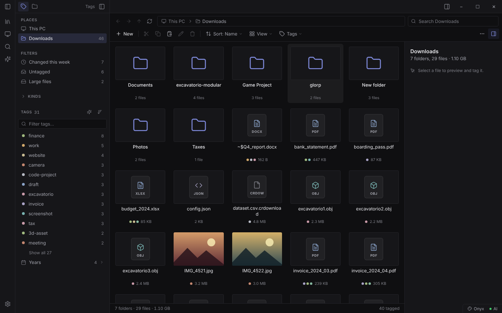
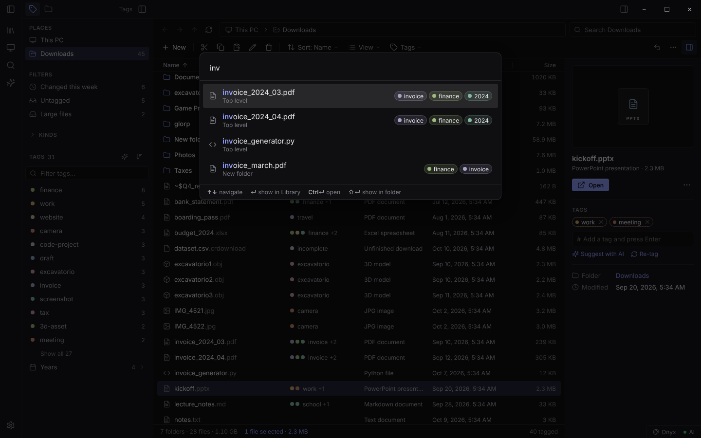
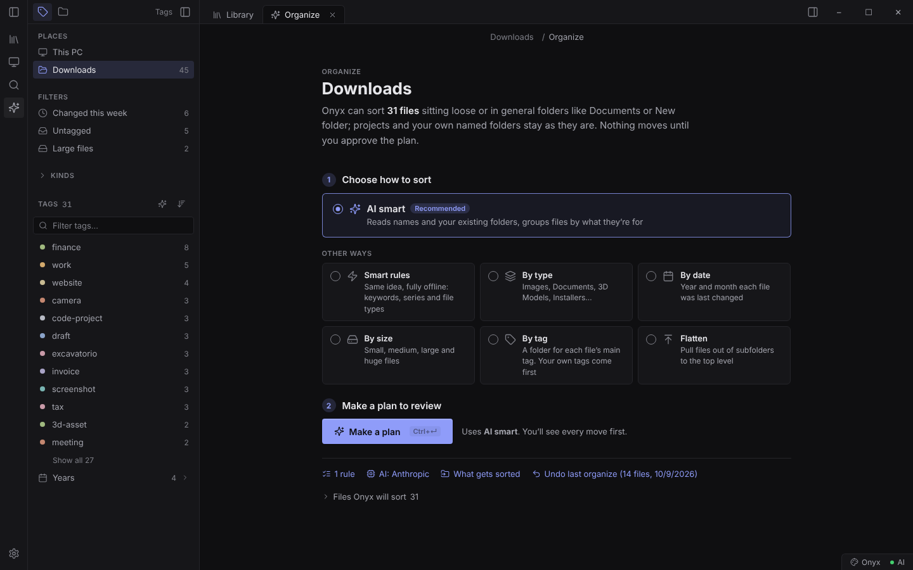
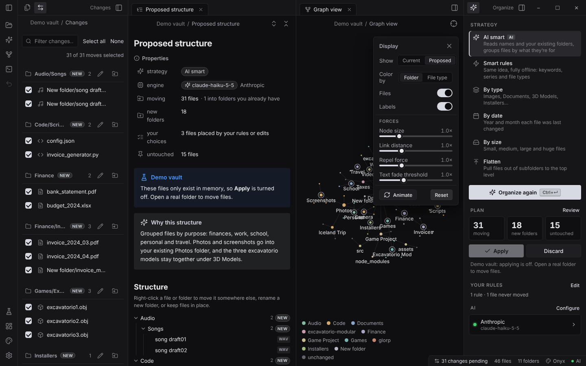
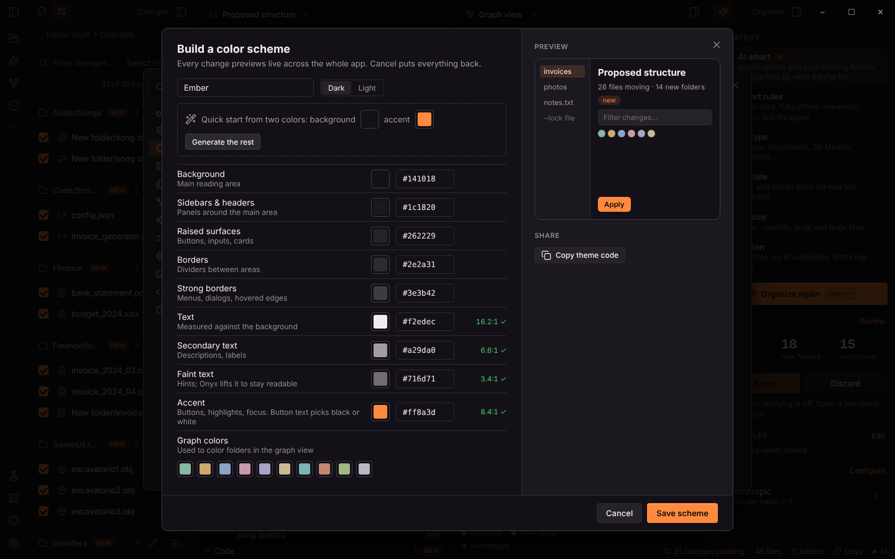
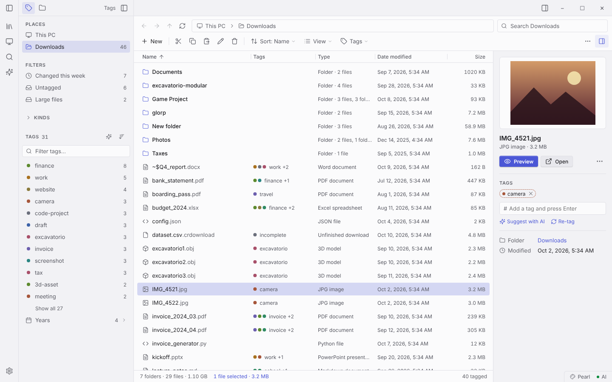
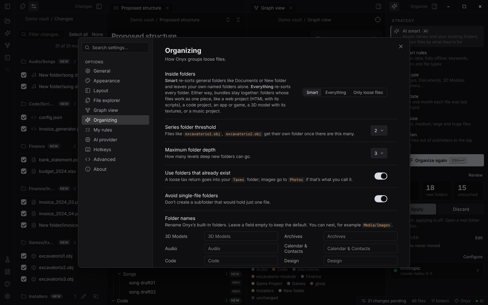

<p align="center">
  
</p>

<p align="center">
  
  
  
  
  <a href="LICENSE"></a>
</p>

<p align="center">
  <a href="#-get-it"><b>Get it</b></a> &nbsp;·&nbsp;
  <a href="#-how-it-works"><b>How it works</b></a> &nbsp;·&nbsp;
  <a href="#-library--tags"><b>Library &amp; tags</b></a> &nbsp;·&nbsp;
  <a href="#-features"><b>Features</b></a> &nbsp;·&nbsp;
  <a href="#-make-it-yours"><b>Make it yours</b></a> &nbsp;·&nbsp;
  <a href="#-shortcuts"><b>Shortcuts</b></a> &nbsp;·&nbsp;
  <a href="#-development"><b>Development</b></a> &nbsp;·&nbsp;
  <a href="#-license"><b>License</b></a>
</p>

<br>

Your Downloads folder is a mess, and every tool that promises to fix it either dumps everything into `Images/` and `Documents/` or moves things without asking. **Onyx is different.** It reads names and the folders you already have, and it plans a structure that makes sense. Nothing on disk moves until you've seen every change and said yes. And if you change your mind, one click puts everything back.

Once things are tidy, Onyx stays useful as **a better file explorer**: every file searchable in one box, tagged by hand or by AI, with previews, saved searches, and a <kbd>Ctrl</kbd> <kbd>K</kbd> quick find that gets you to any file in a second.

<p align="center">
  
</p>

<br>

## ⬇ Get it

> [!IMPORTANT]
> Onyx is proprietary software. The code is public so you can see it, but building, running, copying or redistributing it needs written permission. See [License](#-license).

> [!TIP]
> No installer, no Node.js, no admin rights. One double-click builds the app.

1. **Download** this repo: **Code → Download ZIP**, then unzip it anywhere.
2. **Double-click `Build Onyx.bat`.**
3. Onyx opens. It also lives at `Downloads\onyx\Onyx.exe`, with shortcuts on your desktop and in the Start menu.

<details>
<summary><b>What does the build script actually do?</b></summary>
<br>

| Step | |
| --- | --- |
| 1 | Downloads the official **Electron 32 runtime for Windows x64** from GitHub |
| 2 | Verifies it against Electron's published **SHA-256 checksums** (it stops if they don't match) |
| 3 | Adds the Onyx app files and renames `electron.exe` to `Onyx.exe` |
| 4 | Stamps the **onyx stone icon** and version info onto the exe with `rcedit` |
| 5 | Creates desktop and Start menu shortcuts and refreshes Windows' icon cache |

The download is cached in `%LOCALAPPDATA%\onyx-build`, so running it again to update takes a few seconds.
</details>

<br>

## ◆ How it works



| | |
| --- | --- |
| **Scan** | Onyx reads the folder: file names, types, sizes and dates, plus the folders already there. |
| **Plan** | It proposes where every file should go, reusing your folders wherever it can. |
| **Review** | Everything happens on one Organize screen: pick a way to sort, make a plan, then see it as the new folders or as every single move (or explore it as a graph). Right-click anything to move it, keep it, or turn it into a rule. |
| **Apply** | Only the moves you left checked happen. Name clashes become `file (2).pdf`; nothing is ever overwritten. |
| **Undo** | Every apply writes a journal. One click restores everything exactly as it was. |

<br>

## 🏷 Library &amp; tags

The **Library** is a file explorer that also understands tags. Browse folder by folder like Windows Explorer, with a clickable address bar, Back / Forward / Up (<kbd>Alt</kbd> <kbd>←</kbd> <kbd>→</kbd> <kbd>↑</kbd>, <kbd>Backspace</kbd>, or your mouse's side buttons), double-click to open, and folder sizes at a glance. Or switch to **All files** and see everything inside a folder in one list. Searching looks through the current folder and everything in it: type a name, click a tag, or combine filters like `#invoice type:pdf modified:2024`. Clicking a folder in the Folders pane opens it here, just like Explorer's navigation pane, and <b>This PC</b> shows your recent folders, drives and the usual places on one page.

**Browse whole drives.** Open *This PC* to explore `C:\`, any other drive, your user folder or Program Files, folder by folder, the way Explorer does. Folders load as you open them, so even a full drive is instant, and search looks through everything below where you are. These locations are **browse-only**: you can search, preview, open and tag anything, but Onyx refuses to reorganize a drive or system folder. When you want to tidy something, right-click a folder and choose **Organize this folder**.

### Works like File Explorer
Everything you do in Explorer works here too, with the same keys:

- **New folder** (<kbd>Ctrl</kbd> <kbd>Shift</kbd> <kbd>N</kbd>), **rename in place** (<kbd>F2</kbd>; the extension stays unselected, and Onyx asks before you change it; select several and they become *Holiday (1)*, *Holiday (2)*…).
- **Cut, copy, paste** (<kbd>Ctrl</kbd> <kbd>X</kbd> <kbd>C</kbd> <kbd>V</kbd>) **shared with Explorer's clipboard**: copy in Onyx, paste in Explorer, or the other way round. Pasting into the same folder makes *report - Copy.pdf*; names that already exist get **Replace / Skip / Keep both** (replaced files go to the Recycle Bin, folders merge).
- **Delete to the Recycle Bin** (<kbd>Del</kbd>), or permanently with <kbd>Shift</kbd> <kbd>Del</kbd> after a warning.
- **Undo** (<kbd>Ctrl</kbd> <kbd>Z</kbd>) for renames, moves, copies, new folders and deletes; a deleted file comes straight back out of the Recycle Bin.
- **Drag and drop** onto folders, breadcrumbs or the Files tree (same drive moves, <kbd>Ctrl</kbd> copies), **out of Onyx** into Explorer, the desktop, email or any app, and **in from Explorer**.
- **Windows integration:** Properties (<kbd>Alt</kbd> <kbd>Enter</kbd>), Open with…, Run as administrator, Open in Terminal, Compress to ZIP / Extract all, Create shortcut, Copy as path (<kbd>Ctrl</kbd> <kbd>Shift</kbd> <kbd>C</kbd>), and **Show more options** for Windows' own right-click menu (7-Zip, Send to, and everything else your apps add).
- **Live:** changes made by other programs (a download finishing, a file saved in Explorer) show up on their own.

### Preview anything, with extensions
Press <kbd>Space</kbd> (or double-click) to look at a file without leaving Onyx, and <kbd>←</kbd> <kbd>→</kbd> to flip through the folder. What Onyx can show comes from **extensions**, which you can turn on and off in **Settings → Extensions**:

- **Image Viewer:** zoom (wheel, <kbd>+</kbd> <kbd>−</kbd>, <kbd>1</kbd> for actual size, <kbd>0</kbd> to fit), drag to pan, rotate (<kbd>R</kbd>). HEIC, TIFF, PSD and camera RAW use the preview Windows makes.
- **PDF Viewer:** the viewer from Chrome and Edge (pages, zoom, search, rotate, print), plus the first page in the details pane.
- **Media Player:** video and sound, with a play button in the details pane for auditioning samples.
- **Text Viewer:** notes, logs, CSV and code with line numbers.

Anyone can make more. [EXTENSIONS.md](EXTENSIONS.md) explains how, with a working example in [`examples/extensions`](examples/extensions/csv-table).

Tags follow files when you rename, move or copy them. Your own changes work in browse-only locations too; Onyx just won't *reorganize* them, and it never touches Windows' own folders (Windows, Program Files, AppData) or renames special folders like Downloads.

<p align="center">
  
</p>

<table>
<tr>
<td width="50%" valign="top">

### Tag anything, three ways
- **Automatically, offline.** When a folder opens, Onyx tags new files from their names: `#invoice`, `#tax`, `#screenshot`, `#2024`, a shared tag for a series like `excavatorio1/2/3`, `#website` for an HTML project, `#incomplete` for a half-finished download.
- **With AI.** One click and AI reads the names (never the contents) and adds 1 to 4 tags about topic, project or purpose, like `#iceland-trip` or `#project-atlas`. It reuses your existing tags so the same idea always gets the same tag.
- **By hand.** Select files and press <kbd>#</kbd>, type in the details panel, or drag files onto a tag in the Tags panel.

Tags fit the file type: a sample called *Attack Snare 01.wav* gets `#sounds #percussion #snare`, an FL Studio preset gets `#preset #synth #fl-studio`, and office tags like `#work` never land on sounds, presets, models or apps. Over-specific AI tags are folded into general ones (`attack-snare` → `snare`).

Tags you remove never come back, automatic tags are shown dashed so you can tell them apart, and nested tags like `school/math` just work. If a file got the wrong tags, **Re-tag** replaces its automatic tags with fresh ones; if a tag landed in the wrong places, right-click it and choose **Remove where Onyx added it**.

</td>
<td width="50%" valign="top">

### Find it again
- **Quick find** (<kbd>Ctrl</kbd> <kbd>K</kbd>): fuzzy search by name, path or tag, from anywhere. Enter shows the file, <kbd>Ctrl</kbd> <kbd>Enter</kbd> opens it, <kbd>Shift</kbd> <kbd>Enter</kbd> shows it in its folder.
- **The Tags panel**: every tag with its count, plus *Changed this week*, *Untagged*, *Duplicates* and *Large files*, kinds (Images, Documents…) and your **saved searches**.
- **List or grid** with real Windows thumbnails, sort by name, date, size, type or folder, and **group by tag**, folder, kind or date.
- **Details panel**: preview, tags, folder, size, dates, duplicates, and where the current plan would move it.
- Fast with big folders: 20,000 files filter in under 200 ms.

</td>
</tr>
<tr>
<td></td>
<td></td>
</tr>
</table>

**Search syntax** (mix and match; everything is AND):

| Type | To find |
| --- | --- |
| `budget` `"tax return"` | names, folders and tags containing the words |
| `#invoice` `-#draft` | files with, or without, a tag (`#school` also matches `#school/math`) |
| `type:pdf,docx` &nbsp; `kind:image` | by extension, or by kind: image, video, audio, document, spreadsheet, code, archive, 3d… |
| `size:>100mb` &nbsp; `size:1mb..10mb` | by size |
| `modified:<7d` &nbsp; `modified:>1y` &nbsp; `modified:2024` | by when it last changed |
| `in:Documents` | inside a folder |
| `is:untagged` `is:duplicate` `is:large` `is:recent` | quick filters |

Tags are stored in Onyx's own app-data folder, one small file per folder you open. **Nothing is written into your folders, and your files are never changed.** When Onyx moves files, their tags move with them (and back again on undo); if you move a file yourself, Onyx finds it again by name and size.

<br>

## ✦ Features

<table>
<tr>
<td width="50%" valign="top">

### Understands what things *are*
It doesn't just sort by extension. `tax_return_2023.pdf` goes to **Finance/Taxes**, `IMG_4521.jpg` joins your existing **Photos** folder, and `excavatorio1/2/3.obj` gets grouped as a series. Your own rules, like *"anything with minecraft → Games/Minecraft"*, always win.

</td>
<td width="50%" valign="top">

### Knows what to leave alone
Folders that work as one piece **stay together**: a website (HTML plus its JS and CSS), a code project, a game with its DLLs, a 3D model with its textures, a music project. Folders you named yourself, like **School** or **Work**, are respected. General dumping grounds like **New folder** get sorted.

</td>
</tr>
<tr>
<td colspan="2">

</td>
</tr>
</table>

**Strategies**

| Strategy | What it does |
| --- | --- |
| ✦ **AI smart** | Reads names and your existing folders, and groups files by what they're *for* |
| ⚡ **Smart rules** | The same idea fully offline: keywords, series detection and file types |
| ▤ **By type** | Images, Documents, 3D Models, Installers, … |
| ◷ **By date** | Year and month each file was last changed |
| ◫ **By size** | Small, medium, large and huge |
| 🏷 **By tag** | A folder for each file's main tag (your own tags come first); untagged files stay put |
| ⤒ **Flatten** | Pulls files out of subfolders to the top level (bundles stay intact) |

**Inside folders**: choose how deep Onyx goes.

| Mode | Behaviour |
| --- | --- |
| **Smart** *(default)* | Re-sorts general folders (`New folder`, `Documents`, `Other`, …), keeps your named folders and bundles |
| **Everything** | Re-sorts every subfolder; bundles still stay together |
| **Only loose files** | Never looks inside folders |

**AI providers**: optional. Onyx works fully offline with rules.

| Provider | Key needed | Default model |
| --- | --- | --- |
| free.ai | yes | `qwen3-8b` |
| Pollinations | no | `openai` |
| Any OpenAI-compatible API | yes | `gpt-4o-mini` |
| Anthropic | yes | `claude-haiku-5-5` |

Keys are encrypted with Windows' own credential protection. AI answers are sanitized: no `..` paths, no moving files into your projects, and a fallback to rules if the AI is down or talks nonsense.

<br>

## 🎨 Make it yours

Every panel is a tab you can **drag anywhere**: into either sidebar, into another tab bar, or onto the edge of a pane to split the window. Right-click a tab for the same options, or start from a preset: *Classic, Swapped, Review, Stacked, Focus*.

<p align="center">
  
</p>

<table>
<tr>
<td width="50%" valign="top">

### Build your own color scheme
Pick a background and an accent, and Onyx **generates the whole palette**. Then fine-tune any color. The entire app previews live, every text color shows its contrast ratio, and schemes can be shared as a code.

</td>
<td width="50%" valign="top">

### Or use one of 12 built-in themes
Eight dark (Onyx, Jet, Graphite, Lapis, Jade, Amber, Garnet, Amethyst) and four light (Pearl, Marble, Quartz, Sage), or follow Windows. Plus fonts, zoom, density, corner rounding and custom CSS.

</td>
</tr>
<tr>
<td></td>
<td></td>
</tr>
</table>

<details>
<summary><b>Everything else you can change</b></summary>
<br>



| Section | Highlights |
| --- | --- |
| **General** | Reopen last folder on startup, what to show after organizing, confirm before applying, notification duration |
| **Appearance** | Themes, your own color schemes, accent, fonts, zoom, density, roundness, reduced motion |
| **Layout** | Presets, where each panel lives, ribbon and status bar |
| **File explorer** | Sort order, folders first, type tags, sizes, marks on files that will move, indent guides |
| **Library &amp; tags** | Tag new files automatically, tag with AI, what double-click does, thumbnails, tag dots in the file tree, details panel |
| **Graph view** | Files and labels on or off, color by folder or type, node size, link distance, repel force, text fade |
| **Organizing** | How deep to sort, series threshold, max depth, rename built-in folders (`Images` → `Pictures`) |
| **My rules** | Keyword, extension, pattern, size and age rules; never-move list; folders to keep together or always sort inside |
| **AI provider** | Provider, model, key, and your own instructions |
| **Hotkeys** | Rebind any shortcut |
| **Advanced** | Custom CSS, export and import settings, resets |

Settings are searchable (`Ctrl + ,`, then type).
</details>

<br>

## ⌨ Shortcuts

| Action | Keys | | Action | Keys |
| --- | --- | --- | --- | --- |
| Quick find a file | <kbd>Ctrl</kbd> <kbd>K</kbd> | | Library | <kbd>Ctrl</kbd> <kbd>L</kbd> |
| Search the Library | <kbd>Ctrl</kbd> <kbd>F</kbd> | | Tag selected files | <kbd>Ctrl</kbd> <kbd>T</kbd> or <kbd>#</kbd> |
| Command palette | <kbd>Ctrl</kbd> <kbd>P</kbd> | | Proposed structure | <kbd>Ctrl</kbd> <kbd>1</kbd> |
| Open folder | <kbd>Ctrl</kbd> <kbd>O</kbd> | | Changes | <kbd>Ctrl</kbd> <kbd>2</kbd> |
| Organize | <kbd>Ctrl</kbd> <kbd>Enter</kbd> | | Graph view | <kbd>Ctrl</kbd> <kbd>G</kbd> |
| Apply plan | <kbd>Ctrl</kbd> <kbd>Shift</kbd> <kbd>Enter</kbd> | | Files | <kbd>Ctrl</kbd> <kbd>Shift</kbd> <kbd>E</kbd> |
| Undo last change | <kbd>Ctrl</kbd> <kbd>Z</kbd> | | Search files | <kbd>Ctrl</kbd> <kbd>Shift</kbd> <kbd>F</kbd> |
| Reload from disk | <kbd>Ctrl</kbd> <kbd>R</kbd> / <kbd>F5</kbd> | | Toggle sidebars | <kbd>Ctrl</kbd> <kbd>[</kbd> / <kbd>]</kbd> |
| New folder | <kbd>Ctrl</kbd> <kbd>Shift</kbd> <kbd>N</kbd> | | Rename | <kbd>F2</kbd> |
| Cut / copy / paste | <kbd>Ctrl</kbd> <kbd>X</kbd> / <kbd>C</kbd> / <kbd>V</kbd> | | Delete to Recycle Bin | <kbd>Del</kbd> |
| Properties | <kbd>Alt</kbd> <kbd>Enter</kbd> | | Copy as path | <kbd>Ctrl</kbd> <kbd>Shift</kbd> <kbd>C</kbd> |
| Settings | <kbd>Ctrl</kbd> <kbd>,</kbd> | | Light / dark | <kbd>Ctrl</kbd> <kbd>Shift</kbd> <kbd>L</kbd> |
| Zoom | <kbd>Ctrl</kbd> <kbd>=</kbd> / <kbd>-</kbd> / <kbd>0</kbd> | | | |

All of these can be changed in **Settings → Hotkeys**.

<br>

## 🛡 Safe by design

- **Nothing moves until you apply.** Planning is read-only.
- **Never overwrites.** Clashes get ` (2)`, ` (3)`, and so on. When you choose *Replace* while pasting, the old file goes to the Recycle Bin.
- **Deletes go to the Recycle Bin**, and <kbd>Ctrl</kbd> <kbd>Z</kbd> brings them back. Permanent delete always asks first.
- **Every apply can be undone**, even after restarting Onyx.
- **Refuses to reorganize dangerous places**: drive roots, Windows and Program Files, your whole user folder. You can still browse, search and tag them.
- **Skips system files** like `desktop.ini`, `Thumbs.db` and `pagefile.sys`, and never opens `node_modules`, `.git` or virtual environments.
- **AI can't escape the folder.** Paths are sanitized and checked before anything is planned.

<br>

## ❓ FAQ

<details>
<summary><b>Do I need an AI key?</b></summary>
<br>
No. <b>Smart rules</b> works fully offline, and Pollinations needs no key. A key (free.ai, OpenAI-compatible or Anthropic) just makes AI smart sharper.
</details>

<details>
<summary><b>How do I add an API key without typing it?</b></summary>
<br>
Put a text file named <code>ai-key.txt</code> containing the key next to <code>Onyx.exe</code> (or in <code>resources\app</code>) and start Onyx. It imports the key encrypted, picks the right provider, and <b>deletes the file</b>. The file is in <code>.gitignore</code>, so it can't be committed by accident.
</details>

<details>
<summary><b>Where are my tags stored? Do they change my files?</b></summary>
<br>
In Onyx's app-data folder (<code>%APPDATA%\Onyx\tags</code>), one small file per folder. Onyx never writes tags into your files or folders. They follow files that Onyx moves, come back on undo, and survive you moving a file yourself as long as its name and size stay the same.
</details>

<details>
<summary><b>What does AI tagging send?</b></summary>
<br>
File names, sizes and dates, plus the list of tags you already use, to the AI provider you picked. Never file contents. Offline tagging from names sends nothing at all.
</details>

<details>
<summary><b>Can I try it without touching my files?</b></summary>
<br>
Yes. On the start screen, click <b>Try the demo</b>: a realistic messy folder that only exists in memory.
</details>

<details>
<summary><b>The taskbar still shows an old icon</b></summary>
<br>
Windows caches icons aggressively. Run <code>Build Onyx.bat</code> again (it refreshes the cache), or sign out and back in.
</details>

<br>

## 🛠 Development

Needs [Node.js](https://nodejs.org).

```bash
npm install
npm start        # run with Electron
npm test         # organizing, undo, settings, AI-provider, tagging and file-operation tests (no Electron needed)
npm run dist     # package with electron-builder (Windows x64)
```

```
onyx/
├── main.js          Electron main process: scan, apply, undo, AI providers, settings
├── preload.js       the window.onyx bridge (context-isolated)
├── engine.js        pure organizing logic, shared by main and renderer
├── tags.js          tagging: offline tagger, AI prompt, search language, tag database
├── library.js       the Library, Tags panel, quick find and tag editor
├── ops.js           file operations in the Library: rename, cut/copy/paste, delete, undo, drag and drop
├── extensions.js    the extension registry (built-in and community extensions)
├── viewer.js        the viewer that extensions draw into
├── extensions/      built-in extensions: Image Viewer, PDF Viewer, Media Player, Text Viewer
├── fileops.js       the file-operation engine (Explorer's naming rules, Recycle Bin restore), pure Node
├── winshell.js      Windows integration: shared clipboard, Windows' right-click menu, Properties, ZIP
├── renderer.js      app UI and commands
├── workspace.js     draggable, dockable panels
├── settings.js      settings window and color scheme builder
├── theme.js         theme engine, presets and palette generator
├── graph.js         force-directed graph view
├── icons.js         Lucide icons
├── build-onyx.ps1   no-tools Windows build (run via "Build Onyx.bat")
└── test/            Node tests
```

<br>

## ⚖ License

**Copyright © 2026 Alexander Dunn. All rights reserved.**

Onyx is proprietary. You're welcome to read the code here on GitHub, but no license is granted: copying, modifying, building, running, redistributing or selling it, in whole or in part, needs prior written permission. Forking on GitHub doesn't grant any of those rights. The full terms are in [`LICENSE`](LICENSE). For permission or licensing enquiries, get in touch via [@Barbaqueda](https://github.com/Barbaqueda).

<br>

<p align="center">
  <br>
  <sub>Onyx: tidy folders, no surprises.</sub>
</p>
